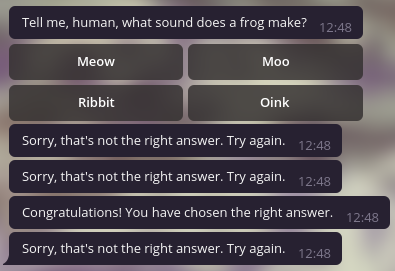
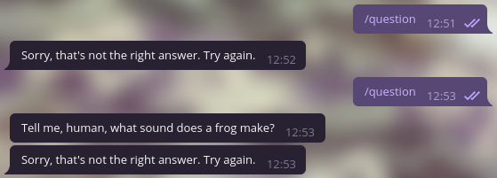
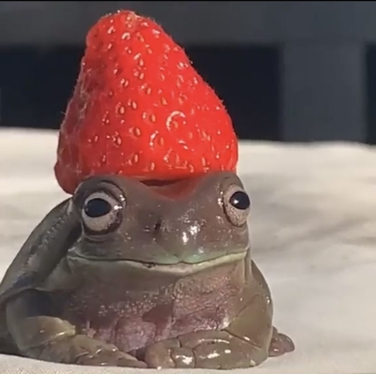

# _**A Little Tutorial on Some Useful Functions from the Telegram API**_
##### **by Gabriela Satie**

<br/>

## &nbsp;&nbsp;**0. My Motivations**

&nbsp;&nbsp;&nbsp;&nbsp;When I started programming by the end of 2019, I knew my main goal was to help people with my work. Even though it was always in the back of my mind when I got into university, I hadn't thought of a project that could have the impact I strived for, or even something that I was capable of doing with my limited skills. That is, until October 2020.

&nbsp;&nbsp;&nbsp;&nbsp;Until that month, I had been feeling as if I were completely lost. I had forgotten what my true motivations were, and I couldn't put into words the desolate feeling of not being able to help in any way, even more so because of the chaotic state the whole world was (and currently _is_) in. But I kept trying to learn new things and not lose hope that someday I'd be good enough to do something to help.

&nbsp;&nbsp;&nbsp;&nbsp;The perfect opportunity arose when I learned about an online hackathon for women called **SheHacksBr**. It was organized by *USPCodeLab*, an extension group from my university (*University of São Paulo*), and I caught wind of it through the president of one of their headquarters (*USPCodelab Sanca*), Carolina Arenas. Their theme was: "Inovative ways of improving people's quality of life". I instantly got excited and talked to my female friends from university, setting up a team of four: Me (of course), Milena Corrêa, Ana Vitória Freitas and Luísa Balleroni.

&nbsp;&nbsp;&nbsp;&nbsp;We brainstormed some ideas and came up with a, pardon my lack of modesty, really really cool project! It's an open source Telegram bot that mimics a restaurant, using hidden menus and commands to help women in danger and abusive situations in general. The goal is to look as real as possible as to not alarm the abusers that might be nearby or even watching the conversation take place. I'll link our GitHub accounts and the project's code below, where you can find a more detailed explanation of our work (I'll try to translate it as soon as possible!).

- [**Gabriela (me)**](https://github.com/gabiusp)
- [**Milena**](https://github.com/milenacsilva)
- [**Ana**](https://github.com/anavitoriafreitasusp)
- [**Luísa**](https://github.com/luisashimabucoro)

&nbsp;&nbsp;&nbsp;&nbsp;[**Project Repository**](https://github.com/milenacsilva/shehacks-2020)

 &nbsp;&nbsp;&nbsp;&nbsp;Going into that competition, I knew I'd have to read a ton of documentation, which is something I actually really enjoy, *but* only when the documentation is well-explained. Don't get me wrong, I'm not saying the Telegram API is badly documented, but it's not that great either. It's confusing and often really hard to understand what exactly everything does, specially if you're dealing with more "robust" functions. In an effort to bridge that gap even a little bit, I decided to try to explain some cool things you can do to make your bot look more refined and user-friendly :)

&nbsp;&nbsp;&nbsp;&nbsp;Also, one of my main inspirations for writing this tutorial comes from **Gabriel Kanegae**'s own guide:

&nbsp;&nbsp;&nbsp;&nbsp;[**"Creating a Telegram Bot with Python"**](https://www.gabekanegae.com/creating-a-telegram-bot-with-python/) 

&nbsp;&nbsp;&nbsp;&nbsp;He's one of my seniors and a big inspiration for me as a professional, as well as a person! I highly recommend reading and following his guide, as I will be explaining some functions assuming you already have a simple bot running on Telegram. Without further ado, let's get into it!

<br/>

## &nbsp;&nbsp;**1. Importing the Functions**

&nbsp;&nbsp;&nbsp;&nbsp;Starting with the basics, you want to make sure you import the functions we'll be using from now on. The beginning of your main file should look like this:


```python
from telegram import InlineKeyboardButton, InlineKeyboardMarkup
from telegram.ext import Updater, CommandHandler, ConversationHandler, CallbackQueryHandler, MessageHandler, Filters
import logging
import os
```

&nbsp;&nbsp;&nbsp;&nbsp;But what does all of that mean?
- _**InlineKeyboardButton**_: defines a button (you can create more than one within the 'keyboard')
- _**InlineKeyboardMarkup**_: puts all of the buttons you chose to define in a 'markup' so you can send them attached to a message
- _**Handlers**_:
    - used to define the behavior of the bot's commands (*CommandHandler*)
    - a chain of commands (*ConversationHandler*)
    - the queries sent back by the buttons (*CallbackQueryHandler*)
    - the messages sent by the user (*MessageHandler*)
- _**Filters**_: used by the *MessageHandler* to specify which type of message or media we're dealing with (such as photos or audios)
- _**logging**_: it basically sends you information about the program running, in this case your bot
- _**os**_: we'll use this later on to delete a file from our computer or server

&nbsp;&nbsp;&nbsp;&nbsp;Don't worry if you don't understand everything right away, it'll get much clearer when we (finally) start coding!

<br/>

## &nbsp;&nbsp;**2. Adding Buttons**

&nbsp;&nbsp;&nbsp;&nbsp;First, let's create a simple 'start' function:


```python
def start(update, context):
    message = "Hey, @{}!".format(update.effective_user.username)
    # 'update.effective_user.username' returns the user's @
    context.bot.send_message(chat_id=update.effective_chat.id, text=message)
    
    return
```

&nbsp;&nbsp;&nbsp;&nbsp;To run this command, simply add the following line to your main function:


```python
# dp = updater.dispatcher
dp.add_handler(CommandHandler("start", start))
```

&nbsp;&nbsp;&nbsp;&nbsp;That looks nice, but it's not exactly very interactive. What about a function that asks the user a question? Well, let's have fun with buttons!


```python
# You can choose whatever question you want!
def question(update, context):
    prompt = "Tell me, human, what sound does a frog make?"
    
    # Now, let's define our buttons (I chose to put four options)
    keyboard = [
        [InlineKeyboardButton(text="Meow", callback_data='wrong'),
         InlineKeyboardButton(text="Moo", callback_data='wrong')],
        [InlineKeyboardButton(text="Ribbit", callback_data='right'),
         InlineKeyboardButton(text="Oink", callback_data='wrong')]
    ]
```

&nbsp;&nbsp;&nbsp;&nbsp;Notice that I split the four options into two groups of two. They will be displayed like this:

&nbsp;&nbsp;&nbsp;&nbsp;

&nbsp;&nbsp;&nbsp;&nbsp;To change this, simply put whichever buttons you want to be together within the same square brackets.

&nbsp;&nbsp;&nbsp;&nbsp;You might also be wondering what the 'callback_data' means. I'm going to explain how to use it in the next section, but it's basically the data you receive when the user clicks on a button. You can also set it to a number or multiple words using underscores. Examples:
- callback_data='4'
- callback_data='this_is_a_callback'

&nbsp;&nbsp;&nbsp;&nbsp;Just use whatever's more convenient for your type of question or prompt!


```python
# Ok, we have a keyboard (aka our buttons)! We just need to declare our markup and send our message
    markup = InlineKeyboardMarkup(inline_keyboard=keyboard)
    context.bot.send_message(chat_id=update.effective_chat.id, text=prompt, reply_markup=markup)
    
    return
```

&nbsp;&nbsp;&nbsp;&nbsp;To run this command, simply add the following line to your main function:


```python
dp.add_handler(CommandHandler("question", question))
```

&nbsp;&nbsp;&nbsp;&nbsp;_Voilà!_ As you can see, using and sending buttons is quite simple. The real fun part, however, is how we use 'callback_data' to process or send further information to the user.

<br/>

## &nbsp;&nbsp;**3. Making Your Buttons Interactive**

&nbsp;&nbsp;&nbsp;&nbsp;Let's finally make this command interactive, shall we?


```python
# We need a new function that will process the 'callback_data'
def query_handler(update, context):
    
    # Here, we'll have access to the user's answer
    query = update.callback_query
    query.answer()

    # Change your comparisons depending on what you chose as 'callback_data'
    if query.data == 'wrong':
        wrong = "Sorry, that's not the right answer. Try again."
        context.bot.send_message(chat_id=update.effective_chat.id, text=wrong)
    if query.data == 'right':
        right = "Congratulations! You have chosen the right answer."
        context.bot.send_message(chat_id=update.effective_chat.id, text=right)
    
    return
```

&nbsp;&nbsp;&nbsp;&nbsp;To run this function alongside your question command, simply add the following line to your main function:


```python
dp.add_handler(CallbackQueryHandler(query_handler))
```

&nbsp;&nbsp;&nbsp;&nbsp;If you click on the buttons from top to bottom, it should look like this:

&nbsp;&nbsp;&nbsp;&nbsp;

&nbsp;&nbsp;&nbsp;&nbsp;If you want it to be a little cleaner after the user has answered, you can either delete the whole message sent by the bot (with the buttons), or just the buttons.
- Deleting the whole message:


```python
# First, we need to save the message ID so we can properly delete it
# On your question function, replace this line:
    context.bot.send_message(chat_id=update.effective_chat.id, text=prompt, reply_markup=markup)
# With this one:
    text = context.bot.send_message(chat_id=update.effective_chat.id, text=prompt, reply_markup=markup)
# Then save its ID
    context.bot_data['text_id'] = text.message_id
# You can use context.bot_data['name'] to save bot-related data and access it outside of your function
# There's also context.user_data['name'] to save user-related data
```


```python
# After you've saved the id, add the following lines to all of your if statements on your 'query_handler':
    text_id = context.bot_data['text_id']
    context.bot.delete_message(chat_id=update.effective_chat.id, message_id=text_id)
# It instantly deletes the question along with the buttons attached to it
```

- Deleting only the buttons:


```python
# You just have to add this line to all of your if statements on your 'query_handler':
    context.bot.edit_message_reply_markup(chat_id=query.message.chat_id, message_id=query.message.message_id)
```

&nbsp;&nbsp;&nbsp;&nbsp;Deleting the whole message and deleting only the buttons, respectively, should look like this:

&nbsp;&nbsp;&nbsp;&nbsp;

&nbsp;&nbsp;&nbsp;&nbsp;You can make small modifications, such as only deleting the message or the buttons when the user gets the answer right. To do this, just add the 'query_handler' modifications above to the if statement regarding the right 'callback_data'.

&nbsp;&nbsp;&nbsp;&nbsp;Congratulations! You just wrote your first interactive function with buttons! :) As you can see, the hardest part is just figuring out how everything works, but the actual code is quite straightforward. In the next section, we'll talk about something a bit more complicated, but also not at all impossible (and really fun!).

<br/>

## &nbsp;&nbsp;**4. Using the 'ConversationHandler'**

&nbsp;&nbsp;&nbsp;&nbsp;Let's suppose we want to write a command that waits for the user's answer. To do that, we need to set up a chain of events that will happen before and after the user's message. But how?

&nbsp;&nbsp;&nbsp;&nbsp;First, we need to define a variable to return so we can define the 'ConversationHandler' behavior:


```python
# Right below your import statements, add the following line:
MEDIA = range(1)
# This variable will be returned by the functions you call before the last one. 
```

&nbsp;&nbsp;&nbsp;&nbsp;To make things more interesting, we're going to ask the user for an image. The first step is to build the main command.


```python
def photo(update, context):
    prompt = "Please, send me a photo!"
    context.bot.send_message(chat_id=update.effective_chat.id, text=prompt)
    
    return MEDIA
```

&nbsp;&nbsp;&nbsp;&nbsp;This function then calls the next one, which will save important information we need to process the data.


```python
def save_info(update, context):
    
    # Getting the information of the image sent by the user
    media = context.bot.get_file(update.message.photo[-1])
    
    if media == None: return
    
    prompt = "Do you want me to send you this photo as a document?"
    keyboard = [
        [InlineKeyboardButton(text="Yes", callback_data='yes')],
        [InlineKeyboardButton(text="No", callback_data='no')]
    ]
    markup = InlineKeyboardMarkup(inline_keyboard=keyboard)
    
    context.bot.send_message(chat_id=update.effective_chat.id, text=prompt, reply_markup=markup)
    
    # The media information (so we can save the image if the user presses "Yes")
    context.user_data['media_id'] = media.file_id
    
    return MEDIA
```

&nbsp;&nbsp;&nbsp;&nbsp;Now we just need to handle the 'callback_data'.


```python
def query_handler(update, context):
    query = update.callback_query
    query.answer()
    
    if query.data == 'no':
        goodbye = "Understandable, have a good day!"
        context.bot.send_message(chat_id=update.effective_chat.id, text=goodbye)
    
    if query.data == 'yes':

        # What we're doing here is:
        # - Downloading the image sent by the user
        # - Sending it as a document
        # - Deleting the image from our computer or server
        # - Ending the 'ConversationHandler'
        media_id = context.user_data['media_id']
        photo = context.bot.get_file(media_id)
        photo.download(f"{media_id}.jpg")
        
        context.bot.send_document(chat_id=update.effective_chat.id, document=open(f"{media_id}.jpg", 'rb'))
        os.remove(f"{media_id}.jpg")
    
    return ConversationHandler.END
```

&nbsp;&nbsp;&nbsp;&nbsp;All of our functions are done! We just need to define the 'ConversationHandler'. On your main function, add the following code:


```python
conv_handler = ConversationHandler(
    entry_points=[CommandHandler("photo", photo)], # User sends the /photo command
    states={MEDIA: [MessageHandler(Filters.photo, save_info)]}, # User sends an image
    fallbacks=[CallbackQueryHandler(query_handler)] # 'callback_data' is processed
)
dp.add_handler(conv_handler)
```

&nbsp;&nbsp;&nbsp;&nbsp;In the end, your function should prompt the user for a photo and respond like this:

&nbsp;&nbsp;&nbsp;&nbsp;

&nbsp;&nbsp;&nbsp;&nbsp;You can manage different types of messages with your 'MessageHandler', such as text, audio, image, anything you want! The functions we built are quite simple, but it's just a sneak peek of the many amazing things you can do with the Telegram API.

&nbsp;&nbsp;&nbsp;&nbsp;My boyfriend has a project that processes images and removes their backgrounds using a Deep Learning model. Since it's a Telegram bot, I decided to put all of my knowledge of buttons and handlers into practice, so I'll link the GitHub repository here if you want to see what I did. It's mainly the code written above to get an image from the user, but it's worth checking out the cool Deep Learning aspect of it! :)

&nbsp;&nbsp;&nbsp;&nbsp;["**Background Removal Bot**"](https://github.com/LFRusso/BackgroundRemovalBot)

&nbsp;&nbsp;&nbsp;&nbsp;Well, we've finally come to an end! Thank you so much for reading my first little tutorial, I hope from the bottom of my heart that it has helped you even a small bit :) Feel free to give me feedback or suggestions, and have fun with your bot!

<br/>

&nbsp;&nbsp;&nbsp;&nbsp;
